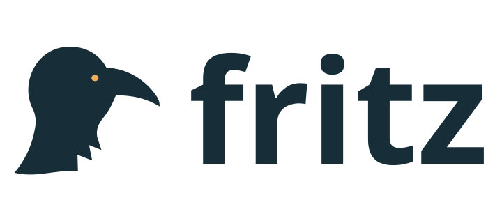
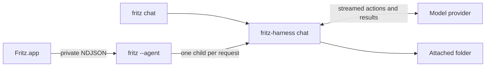

# Fritz

<picture>
  <source media="(prefers-color-scheme: dark)" srcset="design/branding/FritzLogoDark.svg">
  
</picture>

A native macOS personal assistant with persistent conversations and a choice of local or remote models. Fritz keeps chat at the center of the window. The current release provides chat and model management; [the personal assistant plan](docs/personal-assistant-plan.md) sets out how Fritz will add personal context, useful actions, and opt-in follow-through.

Fritz currently groups conversations under folders in the sidebar. Folder-attached conversations can access and change files and run local processes with your macOS permissions when the selected model supports actions. Choose only folders you trust. This workflow is scheduled for replacement with narrower, permission-based personal sources.

## Open source and shared libraries

Fritz's app and shared libraries are licensed under **AGPL-3.0-only**. See
[LICENSE](LICENSE) and [CONTRIBUTING.md](CONTRIBUTING.md). Commercial use is
allowed under the license's source-sharing requirements. Third-party dependencies,
vendored material and model weights retain their respective licenses.

The repository root is a Swift package exposing **Fritz** (provider/model
metadata, private-pipe transport, appearance and CLI installation),
**FritzUI** (shared model/provider pickers and native button styles), and
**FritzUpdates** (Sparkle lifecycle and update policy). The **fritz** Rust library
exposes provider networking, host-scoped registry/Keychain/model storage, native
inference and the current folder actions. The app's executable module is **FritzApp**; the
product remains **Fritz.app**. See [the library guide](docs/libraries.md) for
Git dependency examples, public APIs, ownership and the planned REL adoption.

For shared UI visual regression checks, run `make check-ui-snapshots`. See
[UI verification](docs/agents/ui-verification.md) for coverage and reference review.

## Build and run

Requires macOS 15+, Xcode / Swift 6.3, Rust 1.94+ with rustfmt and Clippy, CMake (for a native TLS dependency), and Python 3 for integration tests.

```sh
make setup     # check tools and resolve committed dependency versions
make dev-open
```

`make dev-open` builds and opens `dist/FritzDebug.app`. A hash of the worktree path gives it a separate bundle ID, data directory, Keychain service, and UserDefaults domain. Debug builds have no update feed. `CONFIGURATION=release make build` stages the optimized `dist/Fritz.app`; neither command installs to `/Applications`. Both bundles include the Rust agent and Markdown resources and are locally signed by default.

## Updates

Fritz includes Sparkle 2.9.6. Open **Fritz → Settings… → General** to choose **Release**, **Beta**, or **Dev**. Beta accepts beta and release items; Dev also accepts dev items. A configured build checks for updates at startup, and **Fritz → Check for Updates** opens Sparkle's update UI. A critical update blocks chat until it is installed. Settings also includes Model Providers, Local Models, bundled Service status, and Debug.

The source version is `0.1.1` in `Cargo.toml` and `app/project.yml`, with Sparkle build number `2`. Release builds use those values by default. Ordinary local builds have no update feed; distribution targets embed Fritz's Sparkle public key and the feed URL configured in `scripts/release-config.sh`. The private key remains in the macOS Keychain under the `fritz` Sparkle account.

`make beta` builds the Developer ID signed app, creates and notarizes `dist/updates/Fritz-0.1.1.dmg`, signs the beta appcast, and publishes both through Fritz's own Cloudflare Worker and R2 bucket. If a signed local beta is already prepared, rerunning `make beta` resumes publication without rebuilding or notarizing. `make publish-beta` also publishes that prepared beta. After testing, `make promote` publishes the same artifact on the Release channel by updating the appcast. See [the release procedure](docs/agents/releases.md) for one-time Cloudflare setup, credentials, verification, and version bumps.

The native Xcode project is `app/Fritz.xcodeproj`; its source specification is `app/project.yml`. Regenerate project structure with `xcodegen generate --spec app/project.yml`. Use the Makefile to stage the complete app with its Rust agent. `app/Package.swift` supports fast Swift builds and unit tests.

Use **+ → New Project** to choose an existing folder and create its first thread. The current app uses “Project” for a folder group; this is a temporary part of its navigation. Use **New Thread** or ⌘N for another conversation. Threads retain separate transcripts, drafts, and model settings. Their titles come from the first message; project and thread context menus also offer Rename.

In **Settings → Model Providers**, click **+** to choose an LLM or decision provider. Search or use the Local / Remote / Frontier / Hosted / Custom filters to find a provider, then enter its API key if needed. The list shows both model categories together; open a provider from the list to edit it. Models load automatically, and the provider editor can retry discovery. **Advanced** contains connection naming and default/manual model choices. Supported LLM adapters: OpenAI (Responses), OpenRouter, Anthropic, Google Gemini, Ollama, and OpenAI-compatible services. Fireworks, Amazon Bedrock Mantle, and Baseten have endpoint presets. The generic endpoint expects the OpenAI chat completions protocol. Ollama uses its native API. Catalogs are discovered live; a manual model ID also supports services without a catalog endpoint.

The composer includes model search, provider filtering, recent selections, and reasoning/speed options for recognized OpenAI models. Return sends; Shift-Return inserts a newline. Escape stops generation. ⌘N creates a thread, ⇧⌘N opens New Project, and ⌘, opens Settings. The toolbar opens its Model Providers page directly. Chat Options can clear the current thread after confirmation. Projects and the selected thread are restored on the next launch. Switching threads keeps an in-progress response attached to its original thread.

## Download local models

In **Settings → Local Models**, click the download button to choose and download
a Fritz model. The download sheet shows its size, recommended memory, license,
progress, and installation status. Cancel stops the download; Retry starts a fresh
attempt. Once the model is installed, add or edit a **Fritz** provider in
**Settings → Model Providers** and select it.
Installed models then become available in the chat model picker. Removing a
provider leaves downloaded weights available for reuse.

Downloads are pinned to repository revisions, file sizes,
and SHA-256 hashes. Models run inside the per-chat Rust harness using
mistral.rs 0.9.4 and Metal, without Ollama or a local HTTP service. No API key is needed. Listing
models or sending a chat never starts a download. Weights live under
`~/Library/Application Support/Fritz/Data/Models/` (or `FRITZ_DATA_DIR/Models`).
The native runtime's licenses ship in the app; each model's license is linked in
the download sheet. Memory recommendations are estimates. Local chat supports an 8,192-token
context and up to 2,048 output tokens per model turn.

In a folder-attached thread, a downloaded Fritz model can use the current folder
actions if its GGUF chat template and checkpoint support structured tool calls.
The same action and turn limits apply as for remote providers. In a conversation
without a folder, local models answer without actions.

## Run a local model API

Open **Settings → Local Models** (or **Models → Local Models…**) to
see installed Fritz models. **Start** launches a separate loopback API process
for that model; the row shows its process ID and address. **Stop** and
**Restart** control that process. The app stops processes it started when it
quits. Chat conversations keep their own harnesses and are unaffected by
these API controls. The model's weights load on its first API request.

For command-line use, `fritz local-models serve` listens on
`127.0.0.1:11435` until interrupted. Pass `--port` to choose another port or
`--model MODEL_ID` to expose only one installed model. The API supports
`GET /api/tags`, `POST /api/chat`, and `POST /api/generate`. Chat and generate
accept text, `stream: false` for one JSON response, or the default incremental
NDJSON stream. `format: "json"` and `options.num_ctx` / `num_predict` are
supported up to 8,192 context tokens; temperature is fixed at zero. Raw prompts,
tool calls, and images are unsupported by this optional API.
The listener binds only to this Mac's loopback interface and starts only when
requested.

## CLI

```sh
make install-cli  # symlink the bundled CLI into ~/.local/bin
fritz --help
fritz local-models list
fritz local-models install qwen3-0.6b-q4_k_m
fritz local-models serve --port 11435
fritz add-provider --name Fritz --provider fritz --model qwen3-0.6b-q4_k_m
fritz chat "Help me plan a quiet weekend" --connection Fritz
fritz providers
fritz add-provider --name Ollama --provider ollama --model llama3.2 --default
fritz models
fritz chat "Make a packing list for a three-day trip" --model llama3.2
fritz chat --connection Ollama --model llama3.2 < prompt.txt
fritz chat "Summarize the notes in this folder" --project /path/to/folder
```

Use **Settings → General → Command Line** to install a symlink to the CLI from `/Applications/Fritz.app` in a writable folder already in PATH. `make install-cli` remains available for a checkout-local CLI. Use `--api-key-stdin` with `add-provider` to read a key from standard input. Keys are never command-line arguments. `fritz default-provider NAME` changes the default, and `fritz remove-provider NAME` removes the connection and its saved key. The CLI shares the app’s provider settings and does not modify the app’s transcript. The current `--project` option attaches a folder and enables its actions when the model supports native function calling. Assistant text goes to stdout and action summaries to stderr.

## Architecture and storage

- `Sources/Fritz/`, `Sources/FritzUI/`, `Sources/FritzState/`, `Sources/FritzUpdates/`: reusable Swift libraries and the shared model catalog.
- `app/`: `FritzApp` SwiftUI/AppKit executable with Textual for native Markdown rendering.
- `crates/fritz-state/`: independent Rust SQLite state library, also re-exported by `fritz::state`.
- `src/`: Rust provider adapters, catalog discovery, credential storage, registry, and CLI. The app supervises `fritz --agent` over private stdin/stdout pipes using request IDs and newline-delimited JSON.
- `src/bin/fritz-harness.rs`, `src/harness.rs`, `src/harness/`: the separate per-request harness, provider-native action loop, and action history. The service resolves credentials and passes them to the harness through private stdin. The harness opens no listener and reads no Keychain items.
- `src/bin/fritz-decision-harness.rs`, `src/decision.rs`, `src/decision_client.rs`: a separate typed-judgment runtime and Jev adapter. The host supplies the credential over a private pipe; neither decision code nor chat code treats Jev as a conversational provider.
- `src/tools.rs`: current folder actions, including listing, reading, creating, and changing files, plus noninteractive local processes. Stop cancels the harness request and terminates child process groups. Closing the app closes the private pipes; closing only the window keeps the app available in the Dock.
- `~/Library/Application Support/Fritz/Data/providers.sqlite`: non-secret provider records and the default connection, owned by Rust. Concurrent CLI/agent updates use SQLite transactions.
- `~/Library/Application Support/Fritz/Data/workspace.sqlite`: projects, threads, ordered messages and tool activity, drafts, model choices, selection, appearance, update channel, settings page and model recents, owned by the native app.
- SQLite connections use WAL, foreign keys, bounded lock waits, private file permissions, schema validation and atomic versioned migrations. A corrupt or newer database produces an error; it is never silently reset.
- Legacy JSON files and old application preferences are ignored. There is no import or backwards compatibility. Existing files are left on disk but are no longer read or written.
- Provider secrets remain in Fritz’s Keychain namespace; they are never stored in SQLite. Local model weights remain in `Data/Models`.
- `FRITZ_DATA_DIR` overrides both databases and model storage for isolated development and tests. It does not change the Keychain namespace or macOS/Sparkle-managed preferences.
- Interrupted prose is omitted from future context unless it has tool records; the next turn then receives the activity and an interruption notice so it can inspect current state before retrying.

The app has no embedded web engine or browser runtime. Its Rust runtime handles providers, local models, chat, and the current folder actions.

## Decision models

Under **Settings → Model Providers**, click **+**, choose **Decision Models**, and add Jev with a TypeSafe API key. Fritz stores the key in Keychain and shows Jev alongside LLM providers; Jev never appears in the chat model picker or becomes the default chat provider. Its separate private-pipe harness accepts Choice, Score, and Noul questions and returns validated answers with probabilities. The agent exposes this runtime through `decisions.evaluate`; chat does not invoke it automatically. A shared backend interface is ready for a native local decision model, but none is bundled yet. See [decision-harness architecture](docs/decision-harness.md) and the [personal assistant plan](docs/personal-assistant-plan.md).

## Current folder access and limits



Folder actions accept relative paths and reject parent traversal, `.git`, and
symlinks that resolve outside the selected folder. Changes require a unique
`old_text` match and replace files atomically, preserving permissions; new-file
creation never overwrites. The harness reads the folder's root `AGENTS.md` when
present and instructs the model to check nested guidance before changes.

**Local processes run with your macOS user permissions; the attached folder is a
working directory, not an OS sandbox.** Attach only folders you trust. Processes
use `/bin/bash --noprofile --norc`, a minimal environment, no interactive stdin,
and a default 30-second timeout (maximum 120 seconds). Provider credentials are
not passed to their environments. Child process groups are stopped when they finish.

Each run allows 24 model turns by default (configurable up to 40), 64 actions,
and 10 minutes total. File reads/writes are limited to 512 KiB; read results and
each process output stream are capped at 32 KiB. A limit, provider error, or Stop
ends the run without undoing changes already made. Review the expandable action
activity before continuing. There is no automatic rollback or background
resume. Native action history, including provider reasoning/signatures, is kept
in memory within a run; persisted follow-ups use the transcript and tool records.

The harness uses native tool protocols for OpenAI Responses, Anthropic Messages,
Gemini, Ollama, OpenRouter, and OpenAI-compatible services. A service/model that
rejects tools reports an error; there is no parsing of executable instructions from
ordinary assistant prose. See [harness protocol](docs/protocol.md) for limits,
process ownership, and implementation details.

## Verification

```sh
make test
make check
```

Tests cover stream framing, adapter payloads, model selection, provider categories, independent thread persistence, previous-chat recovery, persistence failures, local-model integrity and cancellation, action parsing/history, file boundaries, atomic changes, process output/timeouts, and the real CLI/agent/harness against local deterministic providers. The decision-harness check uses a local Jev-shaped endpoint and a dummy key to verify typed answers and cancellation. End-to-end action tests cover all six chat adapters, interrupted streams, recovery, limits, and child process cancellation. They do not download weights, require personal API keys, or contact paid services. Real provider credentials are required to validate account-specific model availability and usage limits.

See [docs/protocol.md](docs/protocol.md) for the private app/agent protocol.

## Development guidance

The Codex environment in [.codex/environments/environment.toml](.codex/environments/environment.toml)
provides worktree setup and Run Fritz, Build, Test, and Check actions.
[AGENTS.md](AGENTS.md) documents the architecture and development rules.
The repository includes five [native development skills](docs/agents/skills.md)
for SwiftUI implementation/review, macOS design, concurrency,
and builds/AppKit. See [runtime verification](docs/agents/runtime-verification.md)
and [UI verification](docs/agents/ui-verification.md) for local testing.
