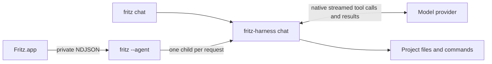

# Fritz

<picture>
  <source media="(prefers-color-scheme: dark)" srcset="design/branding/FritzLogoDark.svg">
  
</picture>

A native macOS chat app with projects and their threads in the left sidebar and chat in the main window. The toolbar’s CPU button opens **Settings → Model Providers**; ⌘, opens Settings. The composer includes searchable model and provider pickers, provider category filters, status badges, and model previews.

Fritz includes its own `fritz-harness` coding-agent runtime. In **Code** mode it reads project files, makes edits, runs commands, inspects the results, and continues until it can answer. **Chat** mode provides a streaming conversation without tools.

## Build and run

Requires macOS 15+, Xcode / Swift 6.3, Rust 1.88+ with rustfmt and Clippy, CMake (for native inference), and Python 3 for integration tests.

```sh
make setup     # check tools and resolve committed dependency versions
make dev-open
```

In a branch with an open PR, this builds and opens `dist/FrizDebug{PR}.app`. The PR number identifies the app in the Dock, while a hash of the worktree path gives it a separate bundle ID, data directory, Keychain service, and UserDefaults domain. Debug builds have no update feed. `CONFIGURATION=release make build` stages the optimized `dist/Fritz.app`; neither command installs to `/Applications`. Both bundles include the Rust agent and Markdown resources and are locally signed by default.

## Updates

Fritz includes Sparkle 2.9.6. Open **Fritz → Settings… → General** to choose **Release**, **Beta**, or **Dev**. Beta accepts beta and release items; Dev also accepts dev items. A configured build checks for updates at startup, and **Fritz → Check for Updates** opens Sparkle's update UI. A critical update blocks chat until it is installed. Settings also includes Model Providers, Local Models, bundled Service status, and Debug.

The source version is `0.1.1` in `Cargo.toml` and `app/project.yml`, with Sparkle build number `2`. Release builds use those values by default. Ordinary local builds have no update feed; distribution targets embed Fritz's Sparkle public key and the feed URL configured in `scripts/release-config.sh`. The private key remains in the macOS Keychain under the `fritz` Sparkle account.

`make beta` builds the Developer ID signed app, creates and notarizes `dist/updates/Fritz-0.1.1.dmg`, signs the beta appcast, and publishes both through Fritz's own Cloudflare Worker and R2 bucket. If a signed local beta is already prepared, rerunning `make beta` resumes publication without rebuilding or notarizing. `make publish-beta` also publishes that prepared beta. After testing, `make promote` publishes the same artifact on the Release channel by updating the appcast. See [the release procedure](docs/agents/releases.md) for one-time Cloudflare setup, credentials, verification, and version bumps.

The native Xcode project is `app/Fritz.xcodeproj`; its source specification is `app/project.yml`. Regenerate project structure with `xcodegen generate --spec app/project.yml`. Use the Makefile to stage the complete app with its Rust agent. `app/Package.swift` supports fast Swift builds and unit tests.

Use **+ → New Project** to choose an existing folder and create its first thread. Project threads default to **Code** mode. The mode control above the composer shows whether Fritz can edit files and run commands; select **Chat** for conversation without tools. Use **New Thread** or ⌘N for another conversation. Threads retain separate transcripts, drafts, and model settings. Their titles come from the first message; project and thread context menus also offer Rename.

In **Settings → Model Providers**, click **Add**, choose a provider using search or the Local / Remote / Frontier / Hosted / Custom filters, and enter its API key. Models load automatically; the refresh button retries discovery. **Advanced** contains connection naming and default/manual model choices. Supported adapters: OpenAI (Responses), OpenRouter, Anthropic, Google Gemini, Ollama, and OpenAI-compatible services. Fireworks, Amazon Bedrock Mantle, and Baseten have endpoint presets. The generic endpoint expects the OpenAI chat completions protocol. Ollama uses its native API. Catalogs are discovered live; a manual model ID also supports services without a catalog endpoint.

The composer includes model search, provider filtering, recent selections, and reasoning/speed options for recognized OpenAI models. Return sends; Shift-Return inserts a newline. Escape stops generation. ⌘N creates a thread, ⇧⌘N opens New Project, and ⌘, opens Settings. The toolbar opens its Model Providers page directly. Chat Options can clear the current thread after confirmation. Projects and the selected thread are restored on the next launch. Switching threads keeps an in-progress response attached to its original thread.

## Download local models

In **Settings → Model Providers → Add**, choose **Fritz** (also shown under **Local**),
select a model, and click **Download & Add**. The setup shows the download size,
recommended memory, license, progress, and installation status. Cancel stops the
download; Retry starts a fresh attempt. After verification, the provider is saved
and installed models become available in the chat model picker. Edit the Fritz
provider to download another model. Removing a provider leaves downloaded weights
available for reuse.

Downloads are pinned to repository revisions, file sizes,
and SHA-256 hashes. Models run offline inside the per-chat Rust harness using
llama.cpp and Metal, without Ollama or a local HTTP service. No API key is needed. Listing
models or sending a chat never starts a download. Weights live under
`~/Library/Application Support/Fritz/Data/Models/` (or `FRITZ_DATA_DIR/Models`).
The native runtime's licenses ship in the app; each model's license is linked in
setup. Memory recommendations are estimates. Local chat supports an 8,192-token
context and up to 2,048 output tokens per reply.

Downloaded Fritz models support **Chat** mode. Select Chat above the composer
for a project thread; use a provider with native tool support for Code mode.

## Run a local model API

Open **Settings → Local Models** (or **Models → Local Models…**) to
see installed Fritz models. **Start** launches a separate loopback API process
for that model; the row shows its process ID and address. **Stop** and
**Restart** control that process. The app stops processes it started when it
quits. Chat conversations keep their own harnesses and are unaffected by
these API controls. The model's weights load on its first API request.

For command-line use, `fritz local-models serve` listens on
`127.0.0.1:11435` until interrupted. Pass `--port` to choose another port or
`--model MODEL_ID` to expose only one installed model. The API supports
`GET /api/tags`, `POST /api/chat`, and `POST /api/generate`. Chat and generate
accept text, `stream: false` for one JSON response, or the default incremental
NDJSON stream. `format: "json"` and `options.num_ctx` / `num_predict` are
supported; temperature is fixed at zero. Tool calls and images are unsupported.
The listener binds only to this Mac's loopback interface and starts only when
requested.

## CLI

```sh
make install-cli  # symlink the bundled CLI into ~/.local/bin
fritz --help
fritz local-models list
fritz local-models install qwen3-0.6b-q4_k_m
fritz local-models serve --port 11435
fritz add-provider --name Fritz --provider fritz --model qwen3-0.6b-q4_k_m
fritz chat "Explain Rust ownership" --connection Fritz
fritz providers
fritz add-provider --name Ollama --provider ollama --model llama3.2 --default
fritz models
fritz chat "Explain Rust ownership" --model llama3.2
fritz chat --connection Ollama --model llama3.2 < prompt.txt
fritz chat "Fix the failing test and verify the change" --project .
fritz chat "Inspect the project" --project /path/to/project --max-turns 12
```

Use **Settings → General → Command Line** to install a symlink to the CLI from `/Applications/Fritz.app` in a writable folder already in PATH. `make install-cli` remains available for a checkout-local CLI. Use `--api-key-stdin` with `add-provider` to read a key from standard input. Keys are never command-line arguments. `fritz default-provider NAME` changes the default, and `fritz remove-provider NAME` removes the connection and its saved key. The CLI shares the app’s provider settings and does not modify the app’s transcript. Without `--project`, it uses Chat mode. With `--project`, it runs the coding loop in that directory; assistant text goes to stdout and tool summaries to stderr. The selected model must support native function/tool calling for Code mode.

## Architecture and storage

- `app/`: SwiftUI/AppKit executable with Textual for native Markdown and code rendering.
- `src/`: Rust provider adapters, catalog discovery, credential storage, registry, and CLI. The app supervises `fritz --agent` over private stdin/stdout pipes using request IDs and newline-delimited JSON.
- `src/bin/fritz-harness.rs`, `src/harness.rs`, `src/harness/`: the separate per-request harness, provider-native model/tool loop, and tool history. The service resolves credentials and passes them to the harness through private stdin. The harness opens no listener and reads no Keychain items.
- `src/tools.rs`: directory listing, paginated text reads, new-file creation, exact-match edits, and noninteractive commands. Stop cancels the harness request and terminates command process groups. Closing the app closes the private pipes; closing only the window keeps the app available in the Dock.
- `~/Library/Application Support/Fritz/Data/providers.json`: versioned, non-secret provider metadata. Writes are atomic and locked across processes.
- `~/Library/Application Support/Fritz/Data/workspace.json`: project folders, thread names and identities, and the selected thread.
- `~/Library/Application Support/Fritz/Data/Threads/`: independent thread transcripts and preferences. Tool activity is retained with each assistant message. Interrupted prose is omitted from future context unless it has tool records; in that case the next turn receives the activity and an interruption notice so it can inspect current state before retrying. An existing `chat.json` is imported once into a **Chats** project and kept as a recovery copy.
- API keys live in macOS Keychain under `dev.fritz.provider-credentials`. Changing an endpoint requires entering a key again.
- `FRITZ_DATA_DIR` overrides data storage for isolated development and tests. Model recents use Fritz’s UserDefaults domain.

The app has no embedded web engine or browser runtime. Its Rust runtime handles providers, local models, chat, and coding tools.

## Coding-agent behavior



File tools accept relative paths and reject parent traversal, `.git`, and symlinks
that resolve outside the selected project. Edits require a unique `old_text`
match and replace files atomically, preserving file permissions; new-file
creation never overwrites. The harness reads the project's root `AGENTS.md`
and instructs the model to check nested guidance before editing.

**Commands run with your macOS user permissions; the project directory is a
working directory, not an OS sandbox.** Code mode is intended for trusted
projects. Commands use `/bin/bash --noprofile --norc`, a minimal environment,
no interactive stdin, and a default 30-second timeout (maximum 120 seconds).
Provider credentials are not passed to command environments. Background
processes in the command's process group are stopped when it finishes.

Each run allows 24 model turns by default (configurable up to 40), 64 tool calls,
and 10 minutes total. File reads/writes are limited to 512 KiB; read results and
each command output stream are capped at 32 KiB. A limit, provider error, or Stop
ends the run without undoing changes already made. Review the expandable tool
activity before continuing. There is no automatic commit, rollback, or background
resume. Native tool history, including provider reasoning/signatures, is kept
in memory within a run; persisted follow-ups use the transcript and tool records.

Code mode uses native tool protocols for OpenAI Responses, Anthropic Messages,
Gemini, Ollama, OpenRouter, and OpenAI-compatible services. A service/model that
rejects tools reports an error; there is no parsing of executable commands from
ordinary assistant prose. See [harness protocol](docs/protocol.md) for limits,
process ownership, and implementation details.

## Verification

```sh
make test
make check
```

Tests cover stream framing, adapter payloads, model selection, provider categories, independent thread persistence, previous-chat recovery, persistence failures, local-model integrity and cancellation, tool parsing/history, file boundaries, atomic edits, command output/timeouts, and the real CLI/agent/harness against local deterministic providers. End-to-end coding tests cover all six adapters, interrupted tool streams, recovery, limits, and process/descendant cancellation. They do not download weights, require API keys, or contact paid services. Real provider credentials are required to validate account-specific model availability and usage limits.

See [docs/protocol.md](docs/protocol.md) for the private app/agent protocol.

## Development guidance

The Codex environment in [.codex/environments/environment.toml](.codex/environments/environment.toml)
provides worktree setup and Run Fritz, Build, Test, and Check actions.
[AGENTS.md](AGENTS.md) documents the architecture and development rules.
The repository includes five [native development skills](docs/agents/skills.md)
for SwiftUI implementation/review, macOS design, concurrency,
and builds/AppKit. See [runtime verification](docs/agents/runtime-verification.md)
and [UI verification](docs/agents/ui-verification.md) for local testing.
