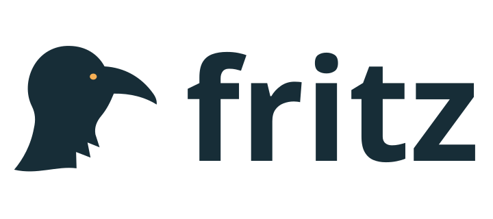
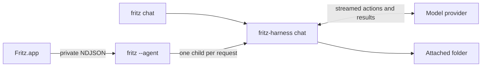

# Fritz

<picture>
  <source media="(prefers-color-scheme: dark)" srcset="design/branding/FritzLogoDark.svg">
  
</picture>

A native macOS personal assistant with persistent conversations and a choice of local or remote models. Fritz keeps chat at the center of the window. The current release provides chat and model management; [the personal assistant plan](docs/personal-assistant-plan.md) sets out how Fritz will add personal context, useful actions, and opt-in follow-through.

Fritz currently groups conversations under folders in the sidebar. Folder-attached conversations can access and change files and run local processes with your macOS permissions when the selected model supports actions. Choose only folders you trust. This workflow is scheduled for replacement with narrower, permission-based personal sources.

## Right panel

The toolbar toggles a blank native inspector on the right, with a resizable
divider. Conversations stay in the main chat area and are selected from the project sidebar. There is no bottom panel.

## Open source and shared libraries

Fritz's app and shared libraries are licensed under **AGPL-3.0-only**. See
[LICENSE](LICENSE) and [CONTRIBUTING.md](CONTRIBUTING.md). Commercial use is
allowed under the license's source-sharing requirements. Third-party dependencies,
vendored material and model weights retain their respective licenses.

The repository root is a Swift package exposing **Fritz** (provider/model
metadata, private-pipe transport, appearance and CLI installation),
**FritzUI** (shared model/provider pickers and native button styles),
**Bonsplit** (reusable tab strips and split panes with REL’s customization), and
**FritzUpdates** (Sparkle lifecycle and update policy). The **fritz** Rust library
exposes provider networking, host-scoped registry/Keychain/model storage, native
inference and the current folder actions. The app's executable module is **FritzApp**; the
product remains **Fritz.app**. See [the library guide](docs/libraries.md) for
Git dependency examples, public APIs, ownership and the planned REL adoption.

For shared UI visual regression checks, run `make check-ui-snapshots`. See
[UI verification](docs/agents/ui-verification.md) for coverage and reference review.

## Install

Open the release DMG and drag Fritz onto the Applications shortcut. Eject the
disk image, then open Fritz from Applications.

## Build and run

Requires macOS 15+, Xcode / Swift 6.3, Rust 1.95+ with rustfmt and Clippy, CMake (for a native TLS dependency), Python 3.11+ for build coordination and integration tests, and mise for the pinned sccache compiler cache.

With rustup, `rust-toolchain.toml` selects Rust 1.95.0 and its rustfmt and Clippy
components for this checkout, independently of your global default. Install it
ahead of time with `rustup toolchain install 1.95.0 --profile minimal --component rustfmt --component clippy`.

```sh
make setup     # check tools and resolve committed dependency versions
make dev-open
```

`make dev-open` builds and opens `dist/FritzDebug.app` in the primary repository checkout on any branch, or on `main` in a linked worktree, without a PR lookup. Other linked branches use `dist/FritzDebug{PR number}.app` when GitHub CLI can resolve a PR; linked branches without a resolvable PR and all detached checkouts use `dist/FritzDebug{checkout hash}.app`. The checkout-path hash still gives each Debug app a separate bundle ID, data directory, Keychain service, and UserDefaults domain. Debug builds have no update feed. `CONFIGURATION=release make build` stages the optimized `dist/Fritz.app`; neither command installs to `/Applications`. Both bundles include the Rust agent and Markdown resources and are locally signed by default.

`make release-build` (also `CONFIGURATION=release make build`) stages the
optimized app at the current source version without selecting a release version,
installing, launching, notarizing, packaging, or publishing. Rust and Xcode
compile concurrently, with full logs in `dist/build-logs/`. Local Swift builds
use only the host architecture; distribution keeps its existing architecture
settings and always stages a fresh artifact.

`make setup` installs sccache pinned in `mise.toml`. Compiler caches and immutable
native Metal libraries live under `~/Builds/Fritz/compiler-cache/`. Unchanged
local builds reuse the signed app after checking source bytes, build settings,
toolchain identity, bundled file hashes, and signatures. No compiler daemon
starts on a reuse hit. Delete `dist/.build-reuse-release.json` or
`dist/.build-reuse-debug.json` to force that configuration to compile and stage.

Build storage lives under `~/Builds/Fritz` by default. Main and worktrees reuse
Cargo outputs and Swift/Xcode package caches; SwiftPM scratch directories and
Xcode DerivedData have separate subdirectories per checkout. Builds and tests
serialize access to shared compiled outputs through tests and app staging.
`make setup` locks only its checkout, so another worktree's build does not delay
dependency setup. Package managers still coordinate their download caches. Set
`FRITZ_BUILD_ROOT=/absolute/path` to use a different location. Existing checkout-local
build folders are left untouched and can be removed once no old builds are using
them. Use `python3 scripts/build-cache.py COMMAND ...` for direct Cargo commands or
integration scripts that need the same paths and lock. See
[build storage details](docs/agents/runtime-verification.md#build-storage).

## Updates

Fritz includes Sparkle 2.9.6. Open **Fritz → Settings… → General** to choose **Release**, **Beta**, or **Staging**. Beta accepts beta and release items; Staging also accepts staging items. Saved Dev selections migrate to Staging on launch. A configured build checks for updates at startup, and **Fritz → Check for Updates** opens Sparkle's update UI. A critical update blocks chat until it is installed. Settings also includes Models, bundled Service status, and Debug.

The source version is `0.1.1` in `Cargo.toml` and `app/project.yml`, with Sparkle build number `2`. Release builds use those values by default. Ordinary local builds have no update feed; distribution targets embed Fritz's Sparkle public key and the feed URL configured in `scripts/release-config.sh`. The private key remains in the macOS Keychain under the `fritz` Sparkle account.

`make staging` publishes a Staging update; `make beta` publishes a Beta update. Both use the same pipeline, which builds the Developer ID signed app, creates and notarizes a versioned DMG in `dist/updates/`, signs the selected channel’s appcast, and publishes both through Fritz's own Cloudflare Worker and R2 bucket. Each run selects the next unused patch version and build number from the source defaults, local artifacts, and published appcast across all channels. `make publish-beta` and `make publish-staging` retry prepared updates without rebuilding or notarizing. Staging updates are excluded from the website download and cannot be promoted directly to Release. After testing a Beta update, `make promote` publishes the same artifact on the Release channel by updating the appcast. Explicit `FRITZ_VERSION` and `FRITZ_BUILD_NUMBER` overrides must exceed existing versions and builds. See [the release procedure](docs/agents/releases.md) for one-time Cloudflare setup, credentials, and verification.

`make publish-beta`, `make publish-staging`, and `make promote` use the staged app's version and build number, so version overrides used to build an update do not need to be repeated for publication or promotion. Keep the staged app, DMG, and appcast together until publication and promotion finish.

The native Xcode project is `app/Fritz.xcodeproj`; its source specification is `app/project.yml`. Regenerate project structure with `xcodegen generate --spec app/project.yml`. Use the Makefile to stage the complete app with its Rust agent. `app/Package.swift` supports fast Swift builds and unit tests.

Use **+ → New Project** to name a project and create its first thread. Fritz creates its folder at `~/Documents/Fritz/{ProjectName}`, replacing spaces and invalid path characters with hyphens. You can also choose an existing folder. The current app uses “Project” for a folder group; this is a temporary part of its navigation. Use **New Chat** from the + or File menu, or press ⌘N, for another conversation. Threads retain separate transcripts, drafts, and model settings. Their titles come from the first message; project and thread context menus also offer Rename.

Chat uses REL’s native conversation layout: a floating composer, compact live tool activity, and a “Worked for…” summary above each completed answer. Expand the summary to review all tool calls, then click a call to inspect its arguments and result. Interrupted responses retain their work with an interrupted status. Older tool records without timing show “Work details.” Scroll up to read without being pulled down by incoming text; **Jump** returns to the latest response.

The **+** and **File** menus also offer **New Model** to add a connection and **New Local Model** to open the download chooser in Settings.

In **Settings → Models**, click **+** and choose any LLM or decision provider from **Provider**. New Models initially selects the first LLM provider preset that has not been added, or OpenAI if all LLM presets are already present. Search or use the System1 / Local / Remote / Frontier / Hosted / Custom filters; System1 shows OpenAI, TypeSafe, and Ollaya decision models. Enter an API key if needed. The list shows both model categories together; open a provider from the list to edit it and change its service using the **Provider** dropdown. A provider and endpoint can be added once; Fritz and Ollaya connections are unique per local model. Duplicate selections show a warning and cannot be added. Model catalogs are discovered automatically, and the provider editor can retry discovery. The Models table summary and Show Models list put newer chat families and flagship variants first, with legacy and specialty models later; this is a display heuristic, not a model-quality evaluation. Click **Show Models** on the Models row to browse and search the discovered models; recently selected models from that provider appear first. Click the **Advanced** section header to show or hide optional Gateway URLs, connection naming, and default/manual model choices. Gateway URL shows the provider’s default endpoint as its placeholder; leave it blank to use that default. OpenAI-compatible connections require a Gateway URL in the main section. Hosted presets supply their own default URLs. TypeSafe also exposes its optional Gateway URL under Advanced. Supported LLM adapters: OpenAI (Responses), OpenRouter, Anthropic, Google (Gemini), Ollama, and OpenAI-compatible services. Fireworks, Amazon Bedrock Mantle, and Baseten have endpoint presets. The generic endpoint expects the OpenAI chat completions protocol. Ollama uses its native API. Catalogs are discovered live; a manual model ID also supports services without a catalog endpoint.

The composer includes model search, provider filtering, recent selections, and reasoning/speed options for recognized OpenAI models. Provider sections show up to five recommended models, ordered by current model family and tier rather than alphabetically. Selecting a provider shows its full catalog without a result limit; OpenAI chat choices exclude known specialty and legacy completion models. This ordering is a display heuristic, not a measured popularity or quality ranking. Its text-only model selector shows friendly model names, the reasoning level, and any nonstandard speed (Fast or Flex) beside the model name. New chats default to Medium reasoning and Standard speed. None reasoning is offered only for models with confirmed support. Reasoning and speed choices come from the bundled `Sources/Fritz/ModelCatalog.json` catalog shared by Swift and Rust. The catalog declares lifecycle status and supported defaults per model. Deprecated models remain selectable but are omitted from recommendations; retired models are unavailable for chat. Unknown model IDs remain selectable without extra controls until their capabilities are reviewed and added. The selected model’s provider appears first in the provider filters and provider sections. Recent stays above the provider sections and shows up to five available models, excluding the current selection; Fritz remembers the last eight distinct selections. The message field receives focus when opening or switching threads, without a focus border. Return sends; Shift-Return inserts a newline. Escape stops generation. ⌘N creates a chat, ⇧⌘N opens New Project, and ⌘, opens Settings. The toolbar opens its Models page directly. Projects and the selected thread are restored on the next launch. Switching threads keeps an in-progress response attached to its original thread.

Every conversation runs through Rig 0.43's agent runtime inside the bundled
`fritz-harness` process. Fritz supplies the provider adapters, local inference,
and application policy. Folder actions use Fritz's own tools registered with Rig;
Rig does not supply the file and shell implementations. Their paths are relative
to the attached folder, with `.` identifying its root.

## Download local models

Click the download icon at the top of **Settings → Models**, or choose
**New Local Model** from the **+** or **File** menu, to download
a Fritz model from a selectable list with Name, Type, Size / Status, and Hardware
Requirements columns. Use the type (LLM or Decision) and model-family capsules
to combine filters; click a selected capsule to remove it, or All to reset.
The downloadable catalog contains LLMs and experimental Laya, Kev and Bosun decision models;
Jev remains a remote Decision Model. In New Models or Edit Models, selecting an
uninstalled Fritz or Ollaya model shows **Download**, which installs that model
directly with progress and cancellation. Installed models have no Download button.
Where Download appears, **Download to** shows its folder; **Choose…** selects
a different folder for that model. Fritz remembers the folder after installation
and uses it for discovery and loading across launches. Other models keep their
own locations; choosing a folder does not move previously downloaded files.
The download catalog shows the selected model’s license, download
progress, and installation status. Cancel stops the download; Retry starts a fresh
attempt. Once the model is installed, add or edit a **Fritz** provider in
**Settings → Models** and select it.
Installed models then become available in the chat model picker. Removing a
provider leaves downloaded weights available for reuse.

Downloads are pinned to repository revisions, file sizes,
and SHA-256 hashes. Models run inside the per-chat Rust harness using
mistral.rs 0.9.4 and Metal, without Ollama or a local HTTP service. No API key is needed. Listing
models or sending a chat never starts a download. By default, weights live under
`~/Models/` in both regular and Debug apps. Fritz creates that folder only when
you first download a model. Debug provider and conversation databases remain
separate. Fritz reports a storage error if it cannot create or write the selected
folder. `FRITZ_MODELS_DIR` overrides the default model folder for tests
or CLI use. A model's saved download folder takes precedence over that default.
Folder choices are stored in the profile's `model_locations.sqlite` database.
Chat GGUFs and decision artifacts are flat files in their selected folder.
A model is installed when its required files are present, regardless
of size, checksum, or optional metadata. Decision configuration uses the matching
model filename with a `.json` extension (for example, `laya-en.onnx` and
`laya-en.json`). New downloads still validate size and SHA-256 before atomic
publication. Older model directories are not read or migrated.
The provider editor shows the installed model file's path and **Open in Finder**
reveals it. Download and local API actions sit beside their status information.
The native runtime's licenses ship in the app; each model's license is linked in
the download sheet. Memory recommendations are estimates. Local chat supports an 8,192-token
context and up to 2,048 output tokens per model turn.

In a folder-attached thread, a downloaded Fritz model can use the current folder
actions if its GGUF chat template and checkpoint support structured tool calls.
The same action and turn limits apply as for remote providers. In a conversation
without a folder, local models answer without actions.

## Run a local model API

Fritz starts one loopback-only local API when the app opens, including when no
models are installed. Its address and process ID are in **Settings → Service**.
Open **Settings → Models** and use **New Models** or **Edit Models** for a Fritz
model. **Download**, **Start**/**Stop**, **Start on**, the installed path, and
**Open in Finder** appear together with the model's load status and errors.
Start loads and retains that model's weights in the shared API; Stop unloads
those weights while leaving the API available. **First use** is the default:
the model loads when an API request needs it. **App start** preloads saved Fritz
connections when the app launches. Startup choices are saved per model in the
workspace database; Cancel leaves the choice unchanged. Manual Start works
before saving a new connection.

Starting another model compares the combined catalog RAM recommendations
against total RAM and the new model's recommendation against available RAM
(free, inactive, and speculative pages, with 2 GB reserved). This check also
applies to first-use API requests. A memory warning offers Start Anyway or
Cancel when the estimated budget is tight or available RAM cannot be measured.
Fritz unloads all API models and stops its listener when it quits. Changing or
deleting a connection unloads its previous API model. Each chat keeps its
separate harness, so API preloading does not warm chat harnesses. Decision
models retain their request-owned decision harnesses.

For command-line use, `fritz local-models serve` listens on
`127.0.0.1:11435` until interrupted. Pass `--port` to choose another port or
`--model MODEL_ID` to expose only one installed model. The API supports
`GET /api/tags`, `POST /api/chat`, and `POST /api/generate`. Chat and generate
accept text, `stream: false` for one JSON response, or the default incremental
NDJSON stream. `format: "json"` and `options.num_ctx` / `num_predict` are
supported up to 8,192 context tokens; temperature is fixed at zero. Raw prompts,
tool calls, and images are unsupported by this optional API.
The listener binds only to this Mac's loopback interface. CLI listeners start
when requested and retain one model between requests.

## CLI

```sh
make install-cli  # symlink the bundled CLI into ~/.local/bin
fritz --help
fritz local-models list
fritz local-models install qwen3-0.6b-q4_k_m
fritz local-models serve --port 11435
fritz add-provider --name Fritz --provider fritz --model qwen3-0.6b-q4_k_m
fritz chat "Help me plan a quiet weekend" --connection Fritz
fritz providers
fritz add-provider --name Ollama --provider ollama --model llama3.2 --default
fritz models
fritz chat "Make a packing list for a three-day trip" --model llama3.2
fritz chat --connection Ollama --model llama3.2 < prompt.txt
fritz chat "Summarize the notes in this folder" --project /path/to/folder
```

Use **Settings → General → Command Line** to install a symlink to the CLI from `/Applications/Fritz.app` in a writable folder already in PATH. `make install-cli` remains available for a checkout-local CLI. Use `--api-key-stdin` with `add-provider` to read a key from standard input. Keys are never command-line arguments. `fritz default-provider NAME` changes the default, and `fritz remove-provider NAME` removes the connection and its saved key. The CLI shares the app’s provider settings and does not modify the app’s transcript. The current `--project` option attaches a folder and enables its actions when the model supports native function calling. Assistant text goes to stdout and action summaries to stderr.

## Architecture and storage

- `Sources/Fritz/`, `Sources/FritzUI/`, `Sources/FritzState/`, `Sources/FritzUpdates/`: reusable Swift libraries and the shared model catalog.
- `app/`: `FritzApp` SwiftUI/AppKit executable with Textual for native Markdown rendering.
- `crates/fritz-state/`: independent Rust SQLite state library, also re-exported by `fritz::state`.
- `src/`: Rust provider adapters, catalog discovery, credential storage, registry, and CLI. The app supervises `fritz --agent` over private stdin/stdout pipes using request IDs and newline-delimited JSON.
- `src/bin/fritz-harness.rs`, `src/harness.rs`, `src/harness/`: the separate per-request harness, Rig-driven agent runtime, and provider-native action history. The service resolves credentials and passes them to the harness through private stdin. The harness opens no listener and reads no Keychain items.
- `src/bin/fritz-decision-harness.rs`, `src/decision.rs`, `src/decision_client.rs`: a separate typed-judgment runtime with OpenAI Decisions, Jev, and native Ollaya adapters. The host supplies remote credentials over a private pipe; local decisions need no key, and decision connections are separate from conversational providers.
- `src/tools.rs`: current folder actions, including listing, reading, creating, and changing files, plus noninteractive local processes. Stop cancels the harness request and terminates child process groups. Closing the app closes the private pipes; closing only the window keeps the app available in the Dock.
- `~/Library/Application Support/Fritz/Data/providers.sqlite`: non-secret provider records and the default connection, owned by Rust. Concurrent CLI/agent updates use SQLite transactions.
- `~/Library/Application Support/Fritz/Data/workspace.sqlite`: projects, threads, ordered messages and tool activity, drafts, model choices, selection, appearance, update channel, settings page and model recents, owned by the native app.
- SQLite connections use WAL, foreign keys, bounded lock waits, private file permissions, schema validation and atomic versioned migrations. A corrupt or newer database produces an error; it is never silently reset.
- Legacy JSON files and old application preferences are ignored. There is no import or backwards compatibility. Existing files are left on disk but are no longer read or written.
- Provider secrets remain in Fritz’s Keychain namespace; they are never stored in SQLite. Chat and decision model files share Models; Debug apps use the system-wide directory described above.
- `FRITZ_DATA_DIR` overrides databases and the default regular-app/CLI model root (`FRITZ_DATA_DIR/Models`). Debug apps use the shared system model root. Set `FRITZ_MODELS_DIR` to override model storage independently, including isolated Debug app tests. Neither override changes the Keychain namespace or macOS/Sparkle-managed preferences.
- Interrupted prose is omitted from future context unless it has tool records; the next turn then receives the activity and an interruption notice so it can inspect current state before retrying.

The app has no embedded web engine or browser runtime. Its Rust runtime handles providers, local models, chat, and the current folder actions.

## Decision models

Under **Settings → Models**, click **+** and choose **OpenAI Decisions** (also available under **System1**). Add an OpenAI API key to use **GPT-6 Luna** (`gpt-6-luna`) through the beta Decisions API. Fritz stores the key in Keychain. This connection is separate from OpenAI chat and cannot become the default chat provider. `decisions.evaluate` and `fritz decide --connection <name-or-id>` use the existing typed state/questions contract: Noul maps to a predicate probability, Choice to named options, and Score to ordered levels. A refused question fails the request explicitly. Chat does not invoke decisions automatically. Fritz supplies JSON state as text evidence; this adapter does not accept image attachments. See the [decision-harness guide](docs/decision-harness.md) for mappings and limits.

Under **Settings → Models**, click **+**, filter **Provider** by **System1**, and add **TypeSafe** with a TypeSafe API key. **Jev** (`jev-latest`) is its decision model. Fritz stores the key in Keychain and shows TypeSafe alongside LLM providers; Jev never appears in the chat model picker or becomes the default chat provider. Its separate private-pipe harness accepts Choice, Score, and Noul questions and returns validated answers with probabilities. The agent exposes this runtime through `decisions.evaluate`; chat does not invoke it automatically. For offline decisions, choose **Ollaya**, download **Laya English (Experimental)** (about 850 MB) or **Kev 1.0 4B (Experimental)** (9.49 GB, 32 GB RAM recommended), and add the provider. Fritz bundles the Ollaya Rust runtime and runs Laya and Kev on CPU inside its decision harness; no Ollaya installation or server is needed. The same local provider also includes **Bosun 3.1 0.6B F16 (Experimental)**, a 1.21 GB download using Fritz's bundled mistral.rs Metal runtime. Bosun returns learned decision-slot probabilities with a 2,048-token rendered-prompt limit; it does not generate chat replies. Its catalog RAM floor is provisional, and workflow quality and 24 GB pairing remain unqualified. Weights download only when explicitly requested. File presence determines installation; new downloads are checked before publication. Local decisions are separate from chat, with a 120-second request limit and explicit errors for state exceeding the model context.

The CLI uses the same provider and harness:

```sh
fritz decision-models list
fritz decision-models install laya-en
fritz add-provider --name 'Local decisions' --provider ollaya --model laya-en
fritz decide --connection 'Local decisions' request.json
```

`request.json` contains `model`, `state`, and typed `questions`, for example:

```json
{"model":"laya-en","state":{"message":"Remind me tomorrow to call Sam"},"questions":{"reminder":{"type":"noul","instructions":"Is the user asking to create a reminder?"}}}
```

Use `-` (the default filename) to read JSON from stdin. The model is loaded for each request; expect seconds of cold-start latency. The initial reminder-routing quality gate did **not** pass; use this experimental backend for explicit evaluation, not automatic reminder actions. See the [evaluation results](docs/agents/local-decision-evaluation.md) before designing a policy around its probabilities. The [local model comparison](docs/local-browser-pairing.md) records frozen selection measurements and their limits. See [decision-harness architecture](docs/decision-harness.md) and the [personal assistant plan](docs/personal-assistant-plan.md).

Hosts can explicitly start the bundled `fritz-decision-harness resident` for
serial Laya/Kev decisions using a versioned private pipe. It reuses weights with
fresh request state, has bounded lifetime and requires host-owned process-group
cleanup. It does not change `fritz decide`, chat, or app decision calls. Bosun
and Jev residency are unsupported. See [messages and lifecycle](docs/decision-harness.md#explicit-resident-local-worker).

To install the compact experimental engine explicitly, use
`fritz decision-models install bosun-v3.1-0.6b-f16`, then add an Ollaya connection
with that model ID. It remains separate from the default chat provider.

Use the **Import and Export** menu beside **+** to import or export providers as cURL. Command-click to select multiple providers. Import accepts cURL exports and GET checks to `models`, `api/tags`, or `health` endpoints with standard API key headers; it parses text without executing shell commands. JSON configurations are not supported. **Overwrite existing** is checked by default and updates a single matching service while preserving its identity and saved key when the endpoint is unchanged. Uncheck it to leave matching services alone. Ambiguous matches require removing duplicates first. Imports without required keys show **Needs Setup** until a key is added. Export offers **Without Keys** or **Including API Keys** and generates a GET request to the provider’s model list, without requiring a model or running inference. cURL comments preserve the provider, connection name, and selected model for import. Commands read their options from stdin, and required omitted keys use `YOUR_API_KEY`, which import treats as missing. Native local model connections without an HTTP endpoint cannot be exported as cURL. Included keys are readable in the copied command. The default chat provider preference and downloaded model files are not exported.

## Current folder access and limits


```mermaid
flowchart LR
    App[Fritz.app] -->|private NDJSON| Service[fritz --agent]
    CLI[fritz chat] --> Harness[fritz-harness chat]
    Service -->|one child per request| Harness
    Harness <-->|streamed actions and results| Provider[Model provider]
    Harness --> Tools[Attached folder]
```

Folder actions accept relative paths and reject parent traversal, `.git`, and
symlinks that resolve outside the selected folder. Changes require a unique
`old_text` match and replace files atomically, preserving permissions; new-file
creation never overwrites. The harness reads the folder's root `AGENTS.md` when
present and instructs the model to check nested guidance before changes.

**Local processes run with your macOS user permissions; the attached folder is a
working directory, not an OS sandbox.** Attach only folders you trust. Processes
use `/bin/bash --noprofile --norc`, a minimal environment, no interactive stdin,
and a default 30-second timeout (maximum 120 seconds). Provider credentials are
not passed to their environments. Child process groups are stopped when they finish.

Each run allows 24 model turns by default (configurable up to 40), 64 actions,
and 10 minutes total. File reads/writes are limited to 512 KiB; read results and
each process output stream are capped at 32 KiB. A limit, provider error, or Stop
ends the run without undoing changes already made. Review the expandable action
activity before continuing. There is no automatic rollback or background
resume. Native action history, including provider reasoning/signatures, is kept
in memory within a run; persisted follow-ups use the transcript and tool records.

The harness uses native tool protocols for OpenAI Responses, Anthropic Messages,
Gemini, Ollama, OpenRouter, and OpenAI-compatible services. A service/model that
rejects tools reports an error; there is no parsing of executable instructions from
ordinary assistant prose. See [harness protocol](docs/protocol.md) for limits,
process ownership, and implementation details.

## Verification

```sh
make test
make check
```

Tests cover stream framing, adapter payloads, model selection, provider categories, independent thread persistence, previous-chat recovery, persistence failures, local-model integrity and cancellation, action parsing/history, file boundaries, atomic changes, process output/timeouts, and the real CLI/agent/harness against local deterministic providers. The decision-harness check uses local Jev and OpenAI Decisions endpoints and a dummy key to verify typed answers and cancellation. End-to-end action tests cover all six chat adapters, interrupted streams, recovery, limits, and child process cancellation. They do not download weights, require personal API keys, or contact paid services. Real provider credentials are required to validate account-specific model availability and usage limits.

See [docs/protocol.md](docs/protocol.md) for the private app/agent protocol.

## Development guidance

The Codex environment in [.codex/environments/environment.toml](.codex/environments/environment.toml)
provides worktree setup and Run Fritz, Build, Test, and Check actions.
[AGENTS.md](AGENTS.md) documents the architecture and development rules.
The repository includes [development skills](docs/agents/skills.md)
for SwiftUI implementation/review, macOS design, concurrency,
builds/AppKit, and test audits. See [runtime verification](docs/agents/runtime-verification.md)
and [UI verification](docs/agents/ui-verification.md) for local testing, and
[model evaluation](docs/agents/model-evaluation.md) for model-quality comparisons.

## Live tool evaluations

The opt-in [tool evaluation suite](docs/agents/model-evaluation.md#live-folder-tool-suite)
checks all five folder tools and multi-step tasks against actual file outcomes.
After `CONFIGURATION=release make build`, run
`python3 evals/run_tools.py --model gpt-6-luna --key-file ~/.aikeys`.
The key file must contain a literal `OPENAI_API_KEY` assignment; the runner does
not source it. Defaults are 12 synthetic cases with two repetitions, with reports
under `dist/evals/`. This makes paid API requests; normal `make test` stays offline.

Each completed or stopped response displays total tokens, cached input tokens, and
USD cost. When all calls report cost, Fritz uses it; otherwise standard-tier calls
use prices in the shared model catalog, accounting for cache and context tiers.
Missing usage or pricing is shown as unavailable. Earlier summaries remain attached
to their responses after another request or a model change.

Supplemental model capabilities, metadata, and prices live in the single
`Sources/Fritz/ModelCatalog.json`. The app seeds from the bundled file and checks
the rel.me catalog on every Models load with HTTP conditional requests. Provider
APIs continue to determine which models your account can access. Models.dev is used
only by the repository's import script, never by the app. The rel.me deployment
must adopt Fritz's exported catalog handler to serve this new representation.

The chat model picker shows every supported language-model provider. Unconfigured provider filters show a small open arrow. Select one to open New Provider with that provider selected; configured providers filter their models, including while discovery is loading or has failed.
